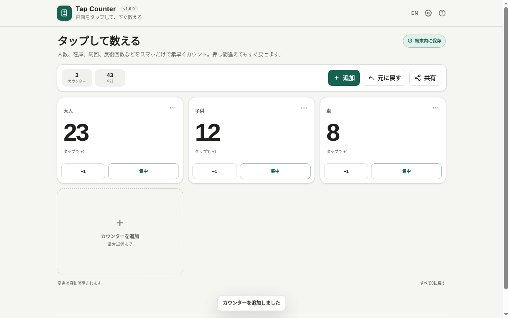
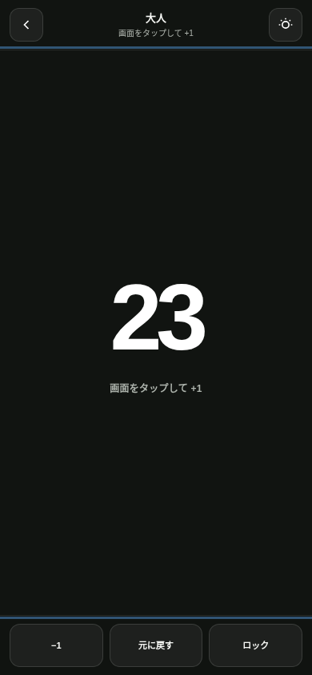

# Tap Counter

[](https://github.com/ttomohisa/htmlapps-tap-counter/actions/workflows/deploy-pages.yml)
[](LICENSE)
[](https://ttomohisa.github.io/htmlapps-tap-counter/)

[日本語版 README](README.ja.md)

An installation-free, single-HTML tally counter for quickly counting people, inventory, laps, repetitions, and more on a phone. Manage multiple categories at once, or open Focus mode and use most of the screen as a large tap target.

## 🚀 Live demo

### [Open Tap Counter on GitHub Pages](https://ttomohisa.github.io/htmlapps-tap-counter/)

No installation or account is required. Counter names, values, and settings are stored in your browser and are not sent to a server by the app.

[](https://ttomohisa.github.io/htmlapps-tap-counter/)

On a phone, Focus mode turns most of the screen into a dedicated tap target for one counter.

[](https://ttomohisa.github.io/htmlapps-tap-counter/)

## Features

- Create up to 12 named counters
- Tap the large area of a counter card to increment by one
- Focus mode dedicated to a single counter
- Use most of the screen as a `+1` tap target in Focus mode
- Decrement and global Undo
- Undo count changes, additions, renames, resets, deletions, and other recent actions
- Lock mode to prevent accidental changes
- Confirmation dialogs for reset, delete, and reset-all actions
- Always-visible total count and counter count
- Copy a summary or use the system share sheet when supported
- Optional vibration feedback on supported devices
- Optional Screen Wake Lock while using Focus mode
- Automatic persistence with LocalStorage
- Japanese and English UI in the same HTML
- Responsive layouts for both desktop and phone use
- No external libraries
- Embedded SVG favicon

## Quick start

### Use the web demo

Just [open the demo](https://ttomohisa.github.io/htmlapps-tap-counter/). A default counter is ready immediately, so you can start counting with one tap.

### Use the downloaded HTML

1. Download [`dist/index.html`](https://github.com/ttomohisa/htmlapps-tap-counter/blob/main/dist/index.html) from this repository.
2. Open the HTML file in a browser.
3. Core counting, persistence, and Focus mode can run from the local HTML file.

Vibration and Screen Wake Lock depend on browser and device support. Screen Wake Lock may require an HTTPS context.

### Use the self-extracting build

The build also produces `dist/index.self-extract.html`. It is a single-HTML distribution format that can restore the readable standalone version in the browser.

## Usage

1. Tap the large area of a counter card to add one.
2. Use **Add** to create categories such as Adults, Children, or Cars.
3. Press **Focus** on a card to open the dedicated counting view.
4. In Focus mode, tap the large center area to count.
5. Use **Undo** when a tap or edit was accidental.
6. Lock the counter when needed to prevent changes while carrying the phone.
7. Use **Share** when finished to share or copy the summary.

### Managing counters

Use the menu in the upper-right corner of each card to rename, reset, or delete that counter. Reset and delete actions ask for confirmation, and completed actions can still be restored with Undo.

Up to 12 counters can be created. If the final remaining counter is deleted, a new empty default counter is created automatically.

### Focus mode

Focus mode hides configuration and other counters so the phone behaves more like a physical tally counter.

- Tap the center area: `+1`
- **-1**: decrement by one
- **Undo**: restore the previous action
- **Lock**: temporarily disable count changes
- Back button in the upper-left: exit Focus mode

When supported, Screen Wake Lock can keep the display awake while Focus mode is open.

### Keyboard shortcuts

The following shortcuts are available in Focus mode.

| Key | Action |
| --- | --- |
| `Space` / `Enter` | +1 |
| `-` | -1 |
| `U` | Undo |
| `L` | Lock / unlock |
| `Esc` | Exit Focus mode |

## Publish with GitHub Pages

This repository includes a workflow that builds and verifies the standalone HTML before deploying it to GitHub Pages.

1. Push the repository to GitHub as `htmlapps-tap-counter`.
2. Open **Settings → Pages → Build and deployment → Source** and select **GitHub Actions**.
3. Push to `main`, or manually run **Deploy GitHub Pages** from the Actions tab.
4. After a successful deployment, the app is available at `https://ttomohisa.github.io/htmlapps-tap-counter/`.

Each push to `main` runs `scripts/check-repository.ps1`, regenerates `dist/index.html` and the self-extracting build, verifies them, and then deploys the `dist` directory.

## Development and build layout

```text
.
├─ src/index.template.html          # Application source template
├─ app.config.json                  # App metadata, version, and build settings
├─ dependencies.json                # Dependency definition (currently empty)
├─ build-standalone.bat             # Windows build entry point
├─ build-standalone.ps1             # Standalone HTML builder
├─ scripts/
│  ├─ check-repository.ps1          # Full repository validation
│  ├─ verify-standalone.ps1         # Readable HTML validation
│  └─ verify-self-extract.ps1       # Self-extract validation
├─ dist/
│  ├─ index.html                    # Readable standalone app
│  └─ index.self-extract.html       # Self-extracting distribution
└─ .github/workflows/
   ├─ build-standalone.yml          # Build validation on push / pull request
   └─ deploy-pages.yml              # Automatic Pages deployment from main
```

On Windows, run:

```bat
build-standalone.bat
```

To run the full repository verification:

```powershell
.\scripts\check-repository.ps1
```

The build process automatically:

- Generates `dist/index.html` from `src/index.template.html`
- Embeds application configuration and build metadata
- Rejects unresolved build placeholders
- Rejects external runtime resource references
- Verifies that the CSP contains `connect-src 'none'`
- Generates `dist/index.self-extract.html`
- Verifies that the restored self-extracting output matches the readable standalone HTML

Python, Node.js, and npm packages are not required.

## Privacy and runtime network protection

Tap Counter performs counting entirely in the browser.

- Counter names, values, and settings are stored in LocalStorage
- No account is required
- No analytics, advertising SDK, or telemetry
- No server-side storage for counter data
- Runtime network connections are blocked by the CSP `connect-src 'none'`
- Sharing and copying happen only after an explicit user action

The GitHub Pages version requires an initial request to load the HTML, but the app does not transmit your counter contents afterward.

## Limitations

- Clearing LocalStorage removes saved counters.
- Private browsing modes may remove stored data sooner than normal browser sessions.
- Vibration feedback is not available on every browser, OS, or device.
- Screen Wake Lock is available only in supporting browsers and may require HTTPS.
- Web Share and clipboard access depend on browser support and permission restrictions.
- A maximum of 12 counters can be created.
- Tap Counter does not synchronize values across devices.

## Dependencies

There are no external library dependencies. The app is implemented with HTML, CSS, JavaScript, and standard browser APIs.

The main optional Web APIs are LocalStorage, Web Share / Clipboard, Vibration, and Screen Wake Lock. Each capability is used progressively only when supported.

See [THIRD_PARTY_NOTICES.md](THIRD_PARTY_NOTICES.md) for details.

## Contributing

Bug reports and feature proposals are welcome through GitHub Issues. See [CONTRIBUTING.md](CONTRIBUTING.md) for development guidance.

## License

Copyright © 2026 ttomohisa

Licensed under the [MIT License](LICENSE).
